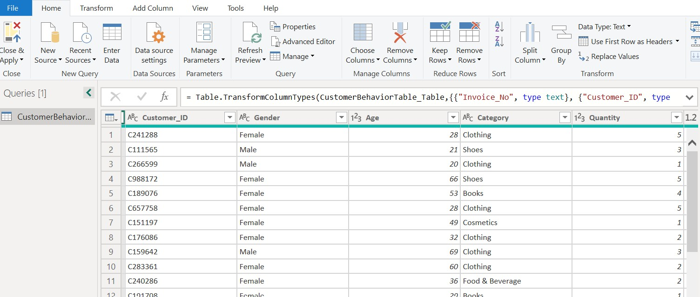
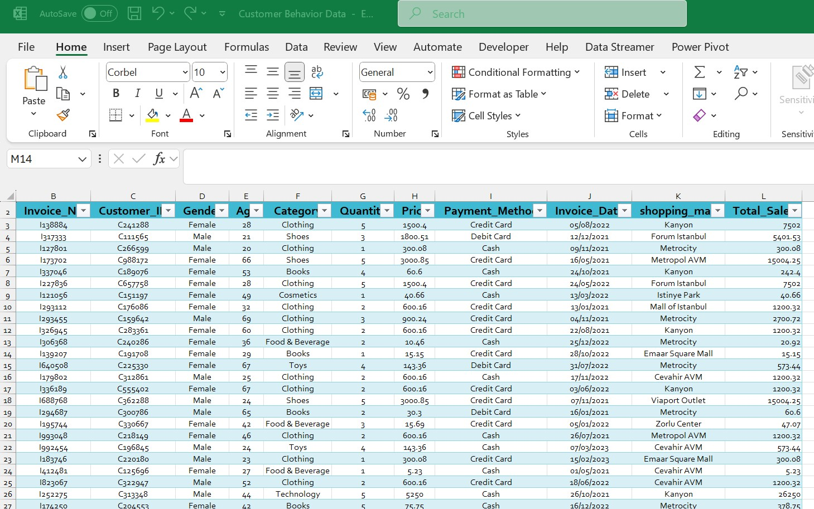
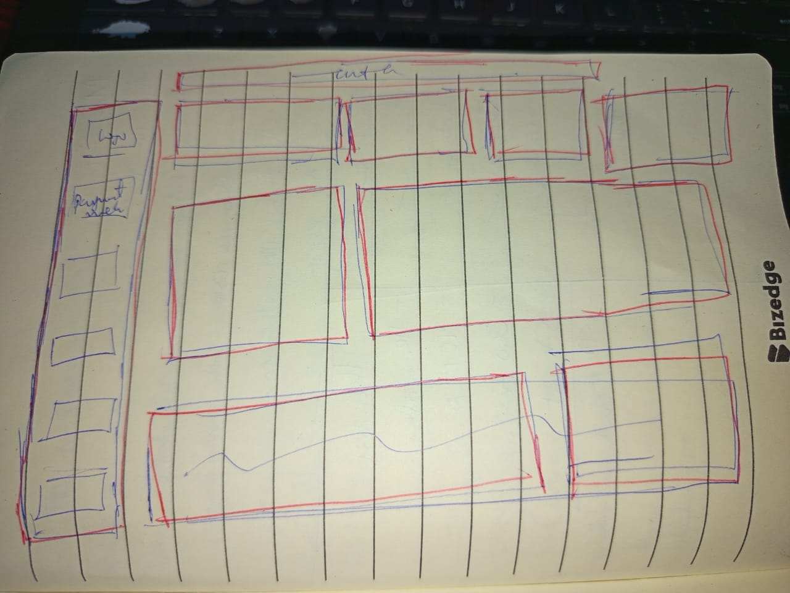
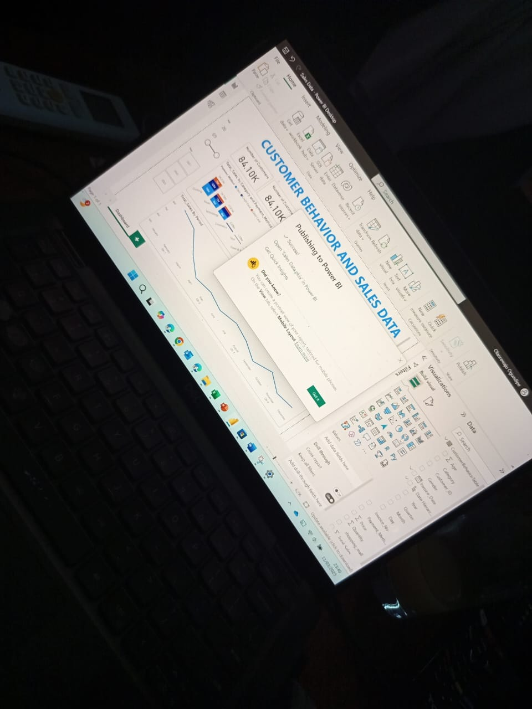

# Customer Behavior and Sales Analysis
This project analyzes a dataset of customer transactions to gain insights into consumer behavior, sales trends, and purchasing patterns. The data contains detailed transaction information.

## Introduction

**Sabi Buys** is an imaginary retail store created for the purpose of this sales analysis project. The objective of this project is to leverage data analytics to gain a deeper understanding of sales performance, customer purchasing behavior, and payment preferences. By analyzing the transactional data from Sabi Buys, the goal is to uncover valuable insights that will help optimize sales strategies, improve customer experience, and support business growth.

**_Disclaimer:_** _The dataset used in this project is fictional and created for analysis purposes only. It does not represent real-world data and should not be used for actual business decisions. Insights drawn are for educational and demonstration purposes._

## Problem Statement
**Sabi Buys** seeks to leverage data analytics to optimize its sales strategies and enhance customer experience. The business aims to answer the following key questions:

1.  How do sales vary across different product categories (e.g., Electronics, Clothing, Groceries)?
2.  Which shopping mall locations generate the highest sales?
3.  What are the preferred payment methods among customers?
4.  How do customer demographics, such as age and gender, influence purchasing decisions across product categories?
5.  Are there any seasonal or time-based trends in sales?

_By answering these questions, the goal is to provide valuable insights that will help **Sabi Buys** improve inventory management, tailor marketing efforts, optimize payment options, and enhance the overall customer experience._

## Skills, Concepts And Technical Competencies Demonstrated

Throughout this project, a range of key skills and technical competencies were developed, with a focus on data cleaning, transformation, analysis, and visualization:

-  Data Import & Transformation: Used Power Query Editor to clean and transform raw data, ensuring accurate and structured data ready for analysis.
-  Data Visualization: Created Card, Bar Charts and Column Charts to display sales total and distribution across categories, malls, and payment methods. Utilized Line Graphs to analyze sales trends over time.
-  UI Design: Applied Custom Themes for consistent and professional report styling. Designed interactive and user-friendly reports with clear layouts for effective storytelling.
-  Interactive Dashboards: Incorporated Slicers on Age, Payment method and Year to enable dynamic filtering, allowing users to drill down into specific data segments for detailed insights.
  
_These skills were essential in organizing, analyzing, and presenting data effectively, enabling actionable insights to drive business decisions._

## Data Transformation
-  Using Power Query editor, the cleaning and formatting was carried out to prepare a cleaned data for visualization
-  Additional column was created to get the Total Sales : Price x Quantity

  Data in Power Query               |      Data in MS Excel
  :----------------------------:    |  :-----------------------: 
           |   

## Visualization
The report is comprises of 2 pages
-  Sales Dashboard
-  Customer Behavior
  
The interactive dashboard can be access :**[HERE](https://app.powerbi.com/groups/me/reports/9758e926-00b6-4914-9311-766034377e9d?ctid=3408fcc1-f4ec-4c84-a2ef-835a7969ad6d&pbi_source=linkShare)**

Sales Dashboard             |    Customer Purchasing
:-----------------------: | :-------------------------:
 | 

## Behind The Scenes: These are behind the scences of creating a sketch for the dashboard and first dashboard before customizing theme
   Dashboard  Sketch                   |           First Dashboard
:-------------------------------:      |    :-------------------------------:
               |      

## Analysis
-  Age Group Purchasing Power: Customers aged 18-35 are the highest spenders, with the largest sales contribution coming from Clothing items, suggesting this age group is highly engaged with fashion-related purchases.
-  Gender Preferences: Female customers show a preference for purchasing Clothing than male. Female also prefer Food & Beverages over books as compared to male.
-  Popular Payment Methods: Cash is the most commonly used payment method across all transactions, but an interesting trend is that female customers tend to use credit cards more frequently than males, who predominantly use cash.
-  Peak Sales Periods: The first quarter of the year, especially January, sees the highest sales, while a notable dip in sales occurs April of the year.
-  Shopping Mall Analysis: Mall of Istanbul and Mall of Kanyon emerged as the top malls, each generating approximately 14M in sales, indicating these malls are performing exceptionally well compared to others

  ## Conlusion & Recommendations
  Based on the insights derived from the analysis, the following recommendations can be made:
- Target the 18-35 Age Group for Promotions: Since this group contributes significantly to sales, especially in Clothing items, targeted promotions or discounts during peak periods (like the start of the year) could help boost sales further.
- Gender-Specific Marketing Campaigns: Tailor marketing efforts to gender preferences by promoting Clothing items and Food & Beverages to female customers, while also considering the purchasing trends of male customers in other categories.
- Payment Method Incentives: Since cash payments dominate transactions, consider offering incentives for card payments, especially for females who are more likely to use credit cards. This could include offering small discounts or loyalty points for credit card transactions.
- Maximize Sales in Peak Periods: With the first quarter (especially January) being the peak sales period, focus on launching seasonal campaigns or special offers during this time to capture the heightened consumer activity.
- Leverage Top-Performing Malls: Since Mall of Istanbul and Mall of Kanyon are performing well, consider launching exclusive events or promotions at these malls to capitalize on their strong customer base. Explore strategies to replicate this success in other malls with lower sales performance.

By following these recommendations, business can optimize their strategies to enhance sales performance, engage with customers more effectively, and drive sustained growth in the competitive retail space.

## Thank You

Thank you for following through this documentation, i will be glad to receive your recommendations and feedback.

